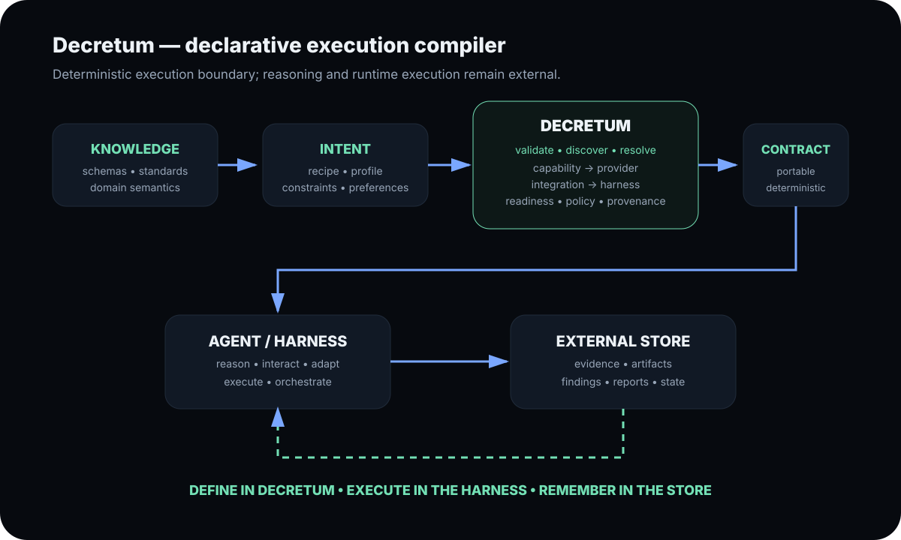

# Architecture

This document records the architectural boundary that future changes must preserve.

## Architecture rule

> **Decretum is a domain-neutral declarative execution compiler/resolver, not a runtime.**

Decretum:

- defines and validates canonical capability semantics
- loads domain schemas and registries
- discovers execution surfaces
- resolves providers, integrations, profiles and harness compatibility
- applies policy
- compiles a portable Execution Contract
- records compile-time provenance and registry snapshots
- verifies contracts read-only

Decretum does **not**:

- start or operate an agent runtime
- provision environments itself
- conduct researcher/agent interaction
- execute experiments or software tasks
- collect evidence as runtime state
- develop findings
- generate reports
- own persistent sessions or stores

## Domain neutrality

Security research is the current reference domain, not the compiler's architectural boundary.

The core compiler must not contain domain-specific execution branches. Domain-specific semantics belong in domain packs:

```
Core
  schema loading
  capability registry
  provider registry
  profiles
  discovery
  validation
  resolver
  policy
  compiler
       |
       +---- Security research pack
       +---- Software engineering pack
       +---- Infrastructure pack
       +---- Data/experiment pack
       +---- Future packs
```

A domain pack can add semantics without turning the core into a domain-specific workflow engine.

## Structured intent model

```
Human spec.md
  |
  +--> optional human-friendly frontend
  |
  v
Spec Compiler
  |
  +--> produces structured ExecutionRecipe

Schema
  |
  +--> defines semantic vocabulary

Recipe
  |
  +--> declares desired outcome/capabilities

Profile
  |
  +--> declares characteristics and preferences

Registry
  |
  +--> declares concrete providers/integrations/harness surfaces

Resolver
  |
  +--> binds intent to available execution surfaces

Compiler
  |
  +--> compiles the validated Recipe into a portable Execution Contract
```

The same recipe can be compiled against different profiles and provider availability without changing its semantic intent.

## Handoff

```
spec.md (optional)
  -> Spec Compiler
  -> ExecutionRecipe
  -> validate / resolve
  -> Execution Contract
  -> External Harness / Agent Runtime
  -> External Store
```

The Recipe is the logical execution plan. The Execution Contract is the resolved, deterministic and enforceable handoff artifact. The contract is the interoperability boundary.

## Iterative execution loop

If the runtime can satisfy the next action with capabilities already present, it remains within its own execution model.

If it needs a new capability, provider, integration, policy permission or changed execution requirement:

```
Harness / Agent
      |
      v
Requirement change
      |
      v
Decretum
      |
      +-- validate
      +-- resolve
      +-- compile
      |
      v
New Execution Contract
      |
      v
Harness / Agent
```

The runtime must not silently redefine Decretum's capability semantics.

## Contract naming

The canonical conceptual contract is **Execution Contract**.

The current security-domain implementation may retain `ResearchExecutionContract` as a compatibility representation while the contract format evolves. New domain-neutral implementations should use a domain-neutral kind and carry explicit domain/intent metadata rather than encoding the domain into the compiler boundary.

## Contribution guardrail

Features that execute work or own an interactive loop belong outside the Decretum compiler core.

Contributors should extend:

- schemas and domain packs
- canonical capabilities
- provider/integration metadata
- profiles
- discovery/readiness
- resolution
- policy
- contract format

Harness/runtime projects should implement:

- execution
- researcher/agent UX
- orchestration
- evidence collection
- finding analysis
- reporting
- persistent state

> **This architecture is intentionally stable: changes should extend the compiler through schemas, registries and domain packs rather than turn it into a runtime.**

## Architecture picture



The diagram shows the intended boundary: Decretum compiles intent into a deterministic contract; the external agent or harness owns reasoning and execution, while persistent state remains external.


## Spec -> Recipe -> Contract boundary

The preferred compilation pipeline is:

    spec.md
       |
       v
    Spec Compiler
       |
       v
    ExecutionRecipe
       |
       v
    Schema Validation
       |
       v
    Capability / Provider / Integration / Harness Resolution
       |
       v
    Recipe
       |
       v
    Execution Contract
       |
       v
    External Harness / Agent Runtime

`spec.md` is an authoring format for humans. It is not treated as an executable contract and the compiler does not infer new canonical capabilities from arbitrary prose.

The Recipe is the declarative execution plan: it describes the intended outcome, capabilities, inputs, outputs, profiles and step dependencies.

The Execution Contract is compiled only after the Recipe is validated and resolved. It records concrete resolution, readiness, policy, provenance, the Recipe digest and the handoff boundary.

This separation permits the same Recipe to produce different contracts when provider, harness or host availability changes while preserving the semantic intent of the Recipe.

If a runtime needs a new capability or changed requirement, the flow returns to the Recipe/Decretum compilation boundary rather than silently mutating the existing contract.
