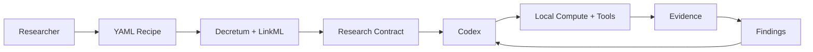
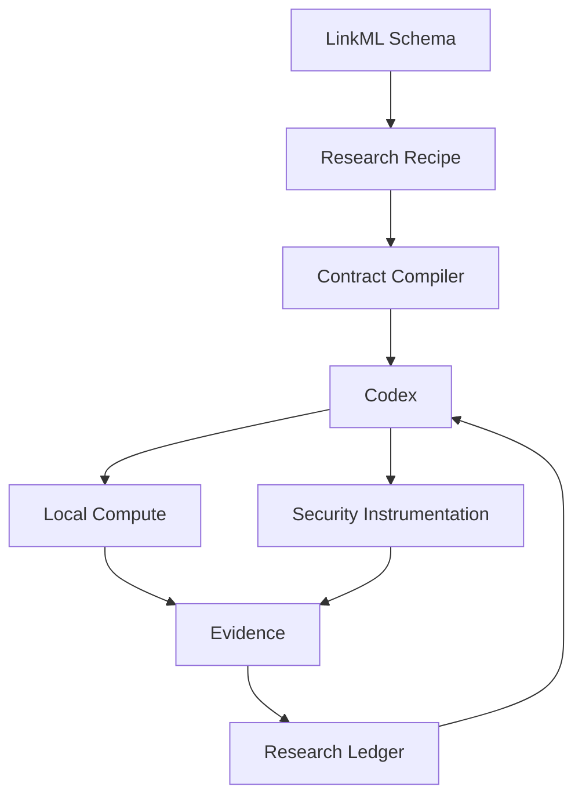

# Decretum\n\n> **Decretum defines the security-research ontology and boundaries. Codex is the interactive researcher that selects, composes, orchestrates, and executes the declared skills.**\n\nDecretum is a **LinkML-based security-research contract compiler**.\n\nYou write a YAML recipe → Decretum validates it → Decretum creates a research contract → Codex investigates → evidence and findings are preserved.\n\n```mermaid\nflowchart LR\n    R[Researcher] --> Y[YAML Recipe]\n    Y --> V[Decretum + LinkML]\n    V --> C[Research Contract]\n    C --> X[Codex]\n    X --> T[Local Tools / MCP]\n    T --> E[Evidence]\n    E --> F[Findings]\n    F --> X\n```\n\n**Local-first:** this branch does not provision hosted/cloud sandboxes.\n\n## The simple mental model\n\n| Part | Meaning |\n|---|---|\n| **Schema** | What concepts and capabilities exist |\n| **Recipe** | What this investigation may use |\n| **Contract** | The validated boundary Codex receives |\n| **Codex** | Interactive researcher and orchestrator |\n| **Tools/MCP** | Implement authorized capabilities |\n| **Evidence** | What was observed |\n| **Findings** | What the research established |\n\n> **Schema = capability vocabulary. Recipe = investigation boundary. Contract = frozen boundary. Codex = researcher.**\n\n## At a glance



> **Schema = what is possible · Recipe = what this investigation allows · Contract = frozen boundary · Codex = researcher**

## Quick start\n\n### 1. Install\n\nRequirements: Python 3.11+, `uv`, and OpenAI/Codex credentials.\n\n```bash\ngit clone https://github.com/Opposum0112/Decretum.git\ncd Decretum\nuv sync\nexport OPENAI_API_KEY="..."\n```\n\nFor Docker support:\n\n```bash\nuv sync --extra docker\n```\n\n### 2. Create a recipe\n\nA recipe answers: **What do I want to investigate, and what is allowed?**\n\n```yaml\napiVersion: decretum.dev/v1\nkind: ResearchExperiment\n\nid: dns-behavior-001\nname: Local DNS behavior investigation\nversion: "1.0"\nrole: threat_researcher\n\nobjective: >\n  Determine whether the supplied program performs DNS activity\n  and identify the observable behavior.\n\nskills:\n  - id: malware.behavior-analysis\n    name: Malware behavior analysis\n    kind: malware_analysis\n    description: Analyze process and network behavior\n    capabilities:\n      - process.observe\n      - network.capture\n\nenvironment:\n  type: local\n  compute:\n    provider: lima\n    instance: security-research-vm\n    cpu: 4\n    memory_mb: 8192\n    ephemeral: true\n  sandbox:\n    backend: lima\n    workspace_directory: /workspace\n    inherit_host_environment: false\n  network:\n    mode: none\n  privileged: false\n\npolicy:\n  allow:\n    - artifact.read\n    - artifact.collect\n    - process.observe\n    - network.observe\n  deny:\n    - host.filesystem.write\n    - host.mount\n    - privileged.host_access\n    - unrestricted.network\n    - cloud.sandbox\n  approval_required:\n    - network.enable\n    - new_capability\n\nevidence:\n  required:\n    - process_activity\n    - network_activity\n    - dns_activity\n    - indicators\n\ncompletion:\n  report_required: true\n  conclusion_required: true\n```\n\n### 3. Validate\n\nValidation does not execute the workload:\n\n```bash\ndecretum validate recipes/dns-behavior.yaml\n```\n\n### 4. Compile\n\n```bash\ndecretum compile recipes/dns-behavior.yaml\n```\n\nThe result is `research-contract.json` — the boundary Codex works inside.\n\n### 5. Run\n\n```bash\ndecretum run recipes/dns-behavior.yaml --dry-run=false\n```\n\nCodex can inspect evidence, select skills, choose instrumentation, run permitted experiments, form hypotheses, and iterate with you.\n\n### 6. Ask follow-up questions\n\n```bash\ndecretum analyze dns-behavior-001 "Analyze the process and DNS evidence."\n\ndecretum analyze dns-behavior-001 "Compare DNS observations with the process timeline."\n\ndecretum analyze dns-behavior-001 "What evidence is still missing?"\n```\n\nThese continue the same research session and ledger.\n\n## How the research works\n\n```mermaid\nflowchart TD\n    A[Question] --> B[Recipe]\n    B --> C[Validate + Compile]\n    C --> D[Codex]\n    D --> E[Experiment]\n    E --> F[Evidence]\n    F --> G[Hypothesis / Finding]\n    G --> H{More evidence needed?}\n    H -- Yes --> D\n    H -- No --> I[Report]\n```\n\nIf Codex needs a capability outside the contract, it must follow the recipe policy/approval path rather than silently expanding access.\n\n## Capabilities and tools\n\nDeclare **what you need**; tools are implementations.\n\n```text\nprocess.observe\n  → Sysdig / Falco / Tracee / Tetragon / bpftrace / BCC / strace / auditd\n\nnetwork.capture\n  → tcpdump / tshark / Wireshark / Zeek / Suricata / Snort\n\nbinary.analyze\n  → Ghidra / radare2 / binwalk / readelf / objdump\n\nmemory.analyze\n  → Volatility / Rekall\n```\n\nLocal compute can include:\n\n```text\nUnix · Docker · Podman · Lima · Incus · LXC · KVM · Firecracker · QEMU\n```\n\n## Persistent research state\n\n```text\nartifacts/<research-id>/\n├── research-contract.json\n├── research-session.sqlite3\n├── research-ledger.jsonl\n├── experiments/\n├── evidence/\n└── report/\n```\n\nFindings retain evidence, references, semantic tags, techniques, confidence, and provenance.\n\n## References\n\nRecipes can reference security frameworks, threat-intelligence reports/feeds, vendor advisories, vulnerability databases, papers, incident reports, malware reports, detection content, and standards.\n\n```yaml\nreferences:\n  - id: ATTCK-T1071-004\n    type: security_framework\n    authority: mitre\n    title: Application Layer Protocol: DNS\n    citation: "ATT&CK T1071.004"\n```\n\n## Architecture



\n\n```mermaid\nflowchart TB\n    S[LinkML Schema<br/>Ontology] --> R[Research Recipe<br/>Authorization]\n    R --> C[Compiler<br/>Research Contract]\n    C --> X[Codex<br/>Select • Compose • Orchestrate • Execute]\n    X --> P[Local Compute]\n    X --> I[Instrumentation]\n    P --> E[Evidence]\n    I --> E\n    E --> F[Findings / Research Ledger]\n    F --> X\n```\n\n### Boundaries\n\n- **Schema:** defines the reusable security-research vocabulary.\n- **Recipe:** selects the boundary for one investigation.\n- **Contract:** freezes the validated recipe.\n- **Codex:** decides how to investigate within that contract.\n- **Tools/MCP:** perform authorized operations.\n- **Research state:** preserves evidence and findings.\n\n## Safety\n\nDecretum is local-first. Unix execution uses host permissions and is not strong isolation. Use an appropriately isolated local environment for hostile workloads.\n\nThe recipe can explicitly deny privileged access, host writes, mounts, unrestricted network access, and cloud sandboxing.\n\n## Contributing\n\nContributions are welcome in four main areas:\n\n1. **Recipes** — add reusable security investigations under `recipes/`.\n2. **Schema** — improve the LinkML ontology and Role → Skill → Capability → Tool → Evidence model.\n3. **Instrumentation** — map new tools to the capabilities they implement.\n4. **Tests/docs** — add regression tests, examples, and researcher guidance.\n\nFor recipe or schema changes:\n\n```bash\ndecretum validate recipes/<topic>.yaml\ndecretum compile recipes/<topic>.yaml\nuv run pytest\n```\n\nFor bugs, open a GitHub issue with the command, minimal recipe, expected/actual behavior, error output, OS, Python version, and Decretum version/commit. Use private security reporting for sensitive vulnerabilities when available.\n\n## Community contributions

Decretum is intended to be a public, community-driven security-research project.

**Easy ways to contribute:**

- **Recipes:** add reusable investigations under `recipes/`.
- **Schema:** add reusable roles, skills, capabilities, evidence, or boundaries.
- **Instrumentation:** map security tools to the capabilities they implement.
- **Tests:** add validation and regression coverage.
- **Docs:** improve researcher workflows and examples.
- **Bugs:** open an issue with a minimal recipe, command, expected/actual behavior, error output, OS, Python version, and Decretum version/commit.

For recipe or schema changes:

```bash
decretum validate recipes/<topic>.yaml
decretum compile recipes/<topic>.yaml
uv run pytest
```

Do not publish sensitive exploit details, credentials, or private research artifacts in public issues.

## Repository\n\n```text\nschema/                 LinkML ontology\nrecipes/                Research recipes\nsec_agent/              Validator, compiler, Codex integration, state\ntests/                  Regression tests\n```\n\n## Status\n\nThe branch currently provides declarative recipes, LinkML validation, contract compilation, reusable roles/skills/capabilities, local compute/instrumentation vocabulary, Codex research sessions, evidence/finding state, hypotheses, experiment requests, and security/TI references.