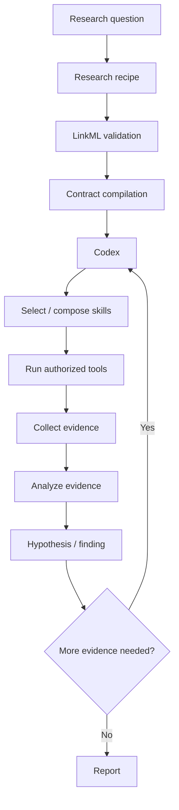
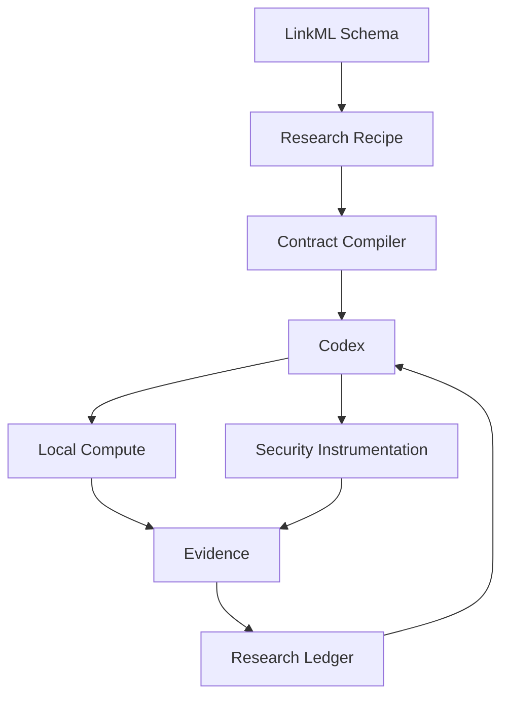

# Decretum

> **Decretum defines the security-research ontology and boundaries. Codex is the interactive researcher that selects, composes, orchestrates, and executes the declared skills.**

Decretum is a **LinkML-based security-research contract compiler**. It turns a declarative research recipe into a validated contract that Codex can investigate within.

**Local-first:** this branch does not provision hosted or cloud sandboxes.


## The mental model

| Layer | Purpose |
| --- | --- |
| **Schema** | Defines the security-research vocabulary and capabilities |
| **Recipe** | Defines the boundary and requirements for one investigation |
| **Contract** | Freezes the validated research boundary |
| **Codex** | Selects, composes, orchestrates, and executes skills interactively |
| **Tools / MCP** | Implement authorized capabilities |
| **Evidence** | Records what was observed |
| **Findings** | Records what the research established |

> **Schema = what is possible · Recipe = what this investigation allows · Contract = frozen boundary · Codex = researcher**

## Quick start

### 1. Install

Requirements: **Python 3.11+**, **uv**, and OpenAI/Codex credentials.

```bash
git clone https://github.com/Opposum0112/Decretum.git
cd Decretum
uv sync
export OPENAI_API_KEY="..."
```

### 2. Validate a recipe

Validation checks the recipe without executing the workload.

```bash
decretum validate recipes/openai-hosted-malware-analysis.yaml
```

### 3. Compile the contract

```bash
decretum compile recipes/openai-hosted-malware-analysis.yaml
```

The compiler produces a machine-readable `research-contract.json` for the research session.

### 4. Run the research

```bash
decretum run recipes/openai-hosted-malware-analysis.yaml --dry-run=false
```

Codex investigates interactively within the compiled contract. It can inspect evidence, select and compose declared skills, use permitted instrumentation, form hypotheses, request experiments, and iterate with the researcher.

### 5. Continue the same research session

```bash
decretum analyze <research-id> "What evidence is still missing?"
decretum analyze <research-id> "Compare the observed process and network activity."
```

### 6. Inspect persisted state

```bash
decretum inspect <research-id>
```

## How research works



Decretum constrains the research space; **Codex explores that space**. If a capability is outside the contract, it must follow the configured approval or contract-amendment path rather than silently expanding access.

## Capability-provider validation

Every capability is required to have at least one registered implementation before a recipe can compile. The provider registry is transport-neutral and supports three provider interfaces:

```text
Capability
   |
   +-- MCP provider
   +-- API provider
   +-- Tool / CLI provider
```

The validator checks the declared capability catalog, skill and role capability references, and compute requirements against `schema/provider_registry.yaml`. A missing provider is a **compile-time error**, not a runtime warning.

This keeps the boundaries explicit:

- **Schema** = capability boundary.
- **Recipe** = execution boundary.
- **Provider** = implementation mechanism.
- **Compiled contract** = frozen machine-readable research boundary.

Adding a new capability therefore follows:

```text
1. Add capability to the LinkML model
2. Add one or more MCP/API/tool providers
3. Validate the provider registry
4. Compile the research recipe
5. Only then hand the contract to the autonomous agent
```

## Capability model

Capabilities are tool-independent. A recipe declares capabilities; concrete tools implement them.

```text
Role
  ↓
Skill
  ↓
Capability
  ↓
Tool / MCP
  ↓
Evidence
  ↓
Finding
```

Examples:

| Capability | Example implementations |
| --- | --- |
| `process.observe` | Sysdig, Falco, Tracee, Tetragon, bpftrace, BCC, strace, auditd |
| `network.capture` | tcpdump, tshark, Wireshark, Zeek, Suricata, Snort |
| `binary.analyze` | Ghidra, radare2, binwalk, readelf, objdump |
| `memory.analyze` | Volatility, Rekall |

Supported local compute vocabulary includes:

`Unix` · `Docker` · `Podman` · `Lima` · `Incus` · `LXC` · `KVM` · `Firecracker` · `QEMU`

## Persistent research state

Each research ID keeps durable local artifacts such as:

```text
artifacts/<research-id>/
├── research-contract.json
├── research-session.sqlite3
├── research-ledger.jsonl
├── experiments/
├── evidence/
└── report/
```

The research ledger preserves evidence, hypotheses, findings, references, semantic tags, techniques, confidence, and provenance so follow-up analysis can continue from the existing research state.

## Architecture



### Clear boundaries

- **Schema** defines reusable concepts, roles, skills, capabilities, evidence, and references.
- **Recipe** declares what one investigation is allowed to use.
- **Compiler** validates and freezes that declaration as a research contract.
- **Codex** decides how to investigate inside the contract.
- **Local compute and tools** perform the authorized work.
- **Research state** preserves the evidence and findings for continued investigation.

## References

Recipes can associate research with security frameworks, threat-intelligence sources, vendor advisories, vulnerability databases, research papers, incident reports, detection content, and standards.

Example:

```yaml
references:
  - id: ATTCK-T1071-004
    type: security_framework
    authority: mitre
    title: Application Layer Protocol: DNS
    citation: "ATT&CK T1071.004"
```

## Safety

Decretum is local-first. Unix execution uses host permissions and should not be treated as strong isolation. Use an appropriately isolated local environment for hostile workloads.

Recipes can explicitly deny privileged access, host filesystem writes, mounts, unrestricted network access, and cloud sandboxing.

## Contributing

Contributions are welcome in:

- **Recipes** — reusable security investigations under `recipes/`.
- **Schema** — roles, skills, capabilities, evidence, boundaries, and references.
- **Instrumentation** — mappings between capabilities and security tools.
- **Tests and documentation** — regression coverage and researcher guidance.

Before submitting recipe or schema changes:

```bash
decretum validate recipes/<topic>.yaml
decretum compile recipes/<topic>.yaml
uv run pytest
```

For bugs, include the command, minimal recipe, expected and actual behavior, error output, OS, Python version, and Decretum version or commit. Do not publish credentials or sensitive research artifacts in public issues.

## Repository layout

```text
schema/       LinkML ontology
recipes/      Research recipes
sec_agent/    Validator, compiler, Codex integration, research state
tests/        Regression tests
```

## Project status

The `refactor/openai-api` branch provides declarative research recipes, LinkML validation, deterministic contract compilation, reusable roles/skills/capabilities, local compute and instrumentation vocabulary, Codex research sessions, durable evidence and finding state, hypotheses, experiment requests, and security/threat-intelligence references.
