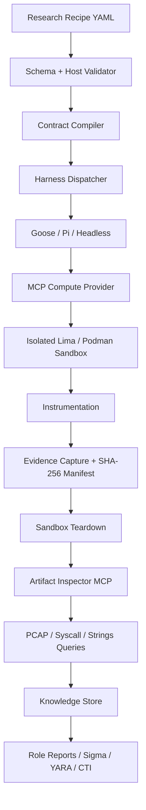

# Decretum

**Declarative Security Research Agent Platform**

Decretum is a model-agnostic security research runtime driven by LinkML experiment contracts. It validates research recipes, provisions isolated Lima/Podman sandboxes, captures tamper-evident evidence, tears down compute, and provides offline forensic triage and role-specific reporting.

## Architecture



## Quick start

Requires Python 3.11+ and `uv`.

```bash
uv sync
uv run sec-agent validate recipes/supply_chain_audit.yaml
uv run sec-agent run recipes/supply_chain_audit.yaml --dry-run
uv run sec-agent triage --artifacts ./artifacts/<run-id>
```

`--dry-run` is the safe default for development. Real sandbox execution is deliberately explicit.

## Repository layout

- `schema/` — LinkML source and compiled schema artifacts
- `sec_agent/` — validator, compiler, dispatcher, MCP services, triage, memory and reporting
- `recipes/` — example declarative research contracts
- `tests/` — unit and contract tests

## Safety model

Untrusted workloads must execute in an isolated compute provider. Provider implementations reject host mounts by default. Evidence is copied to a controlled artifact directory and hashed before teardown. Destructive or external-network workloads should only be enabled by an explicitly configured recipe.

## Workflow

1. Author a LinkML-governed recipe.
2. Validate syntax and semantics.
3. Run host pre-flight checks.
4. Compile an immutable execution contract.
5. Select a harness and MCP provider.
6. Provision an isolated sandbox.
7. Execute the declared workload with instrumentation.
8. Capture evidence and generate `manifest.sha256`.
9. Destroy the sandbox in a guaranteed cleanup path.
10. Query artifacts offline.
11. Persist findings and mappings.
12. Generate role-specific deliverables.

## Example roles

- `supply_chain_auditor` — package audit, file changes, DNS observations, SBOM and risk report
- `detection_engineer` — syscall/network telemetry, Sigma and ATT&CK mappings
- `threat_researcher` — PCAP/process evidence and STIX-oriented reporting
- `vulnerability_exploit_researcher` — ASAN/core/GDB evidence and RCA reporting

## Harnesses

Decretum treats Goose, Pi and headless execution as adapters. The research contract remains independent of any model, agent framework or LLM provider.

## Status

The repository is intentionally implemented in small, testable layers. Provider operations that require a local Lima/Podman installation are guarded by pre-flight checks and are not silently simulated.
