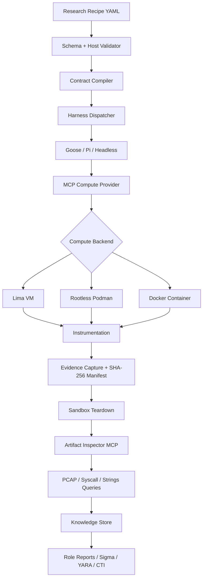

# Decretum

**Declarative Security Research Agent Platform**

Decretum is a model-agnostic security research runtime driven by LinkML experiment contracts. It validates research recipes, provisions isolated compute sandboxes, captures tamper-evident evidence, tears down compute, and provides offline forensic triage and role-specific reporting.

## Compute providers

Decretum supports three sandbox backends:

- **Lima** — isolated QEMU/VZ microVMs for stronger VM-level separation.
- **Podman** — rootless OCI containers with an explicit no-host-mount policy.
- **Docker** — container execution with no host filesystem mounts, dropped capabilities, `no-new-privileges`, read-only root filesystem, and ephemeral tmpfs paths.

Select the backend in a recipe with `compute.provider: lima`, `podman`, or `docker`. The same research contract, instrumentation, evidence model, and MCP interface are used across providers.

## Architecture



## Quick start

Requires Python 3.11+ and `uv`.

```bash
uv sync
uv run sec-agent validate recipes/supply_chain_audit.yaml
uv run sec-agent run recipes/supply_chain_audit.yaml --dry-run
uv run sec-agent triage --artifacts ./artifacts/<run-id>
```

For real execution, install and configure the provider selected by the recipe. Decretum does not silently fall back to host execution.

### Podman

Use rootless Podman. Decretum verifies rootless mode before provisioning and explicitly rejects host mounts.

### Docker

Docker must be available to the invoking user. Decretum creates a unique container per run, disables networking by default, does not bind-mount the host, drops Linux capabilities, enables `no-new-privileges`, and uses an ephemeral read-only container filesystem with tmpfs work directories.

## Repository layout

- `schema/` — LinkML source and compiled schema artifacts
- `sec_agent/` — validator, compiler, dispatcher, MCP services, triage, memory and reporting
- `sec_agent/mcp/` — Lima, Podman, Docker and artifact-inspector MCP providers
- `recipes/` — example declarative research contracts
- `tests/` — unit and contract tests

## Safety model

Untrusted workloads must execute inside an isolated compute provider. Host filesystem mounts are disabled by contract. Evidence is copied to a controlled artifact directory and hashed before teardown. Provider cleanup uses a guaranteed teardown path. Destructive or exploit workloads should remain confined to explicitly configured research sandboxes.

The SHA-256 manifest provides integrity evidence for collected artifacts; it is not, by itself, proof of authenticity or provenance unless the manifest is independently anchored or signed.

## Workflow

1. Author a LinkML-governed recipe.
2. Validate syntax and semantics.
3. Run host pre-flight checks.
4. Compile an immutable execution contract.
5. Select a harness and compute provider.
6. Provision an isolated Lima VM, Podman container, or Docker container.
7. Attach instrumentation.
8. Execute the declared workload.
9. Capture evidence and generate `manifest.sha256`.
10. Destroy the sandbox.
11. Query artifacts offline.
12. Persist findings and mappings.
13. Generate role-specific deliverables.

## Example provider selection

```yaml
compute:
  provider: docker   # lima | podman | docker
  base_image: ubuntu:24.04
  cpus: 2
  memory: 2g
  network: none
  allow_host_mounts: false
```

Changing only `provider` lets the same recipe target another supported compute backend, subject to provider-specific image and instrumentation requirements.

## Example roles

- `supply_chain_auditor` — package audit, file changes, DNS observations, SBOM and risk report
- `detection_engineer` — syscall/network telemetry, Sigma and ATT&CK mappings
- `threat_researcher` — PCAP/process evidence and STIX-oriented reporting
- `vulnerability_exploit_researcher` — ASAN/core/GDB evidence and RCA reporting

## Harnesses

Decretum treats Goose, Pi and headless execution as adapters. The research contract remains independent of any model, agent framework or LLM provider.

## Status

The Lima, Podman, and Docker provider contracts are represented in the LinkML metamodel and compiled JSON Schema. Provider operations requiring local runtime installations are guarded by pre-flight checks and are not silently simulated.
